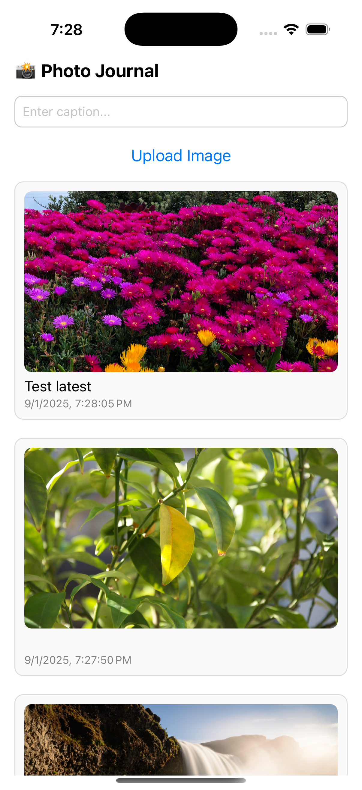
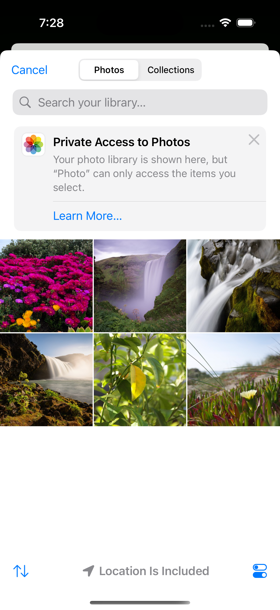

# 📸 Offline Photo Journal

A simple React Native app built with TypeScript that lets you pick photos from your device, add captions, and store them locally for offline access.

---

---

## 🚀 What I Implemented
- Pick images from the device gallery using **react-native-image-picker**  
- Add captions to photos  
- Store photos and captions offline with **AsyncStorage**  
- View saved photos with timestamps  

---

## 🛠️ Tech Choices & Why

### 🔹 TypeScript
- Ensures type safety and reduces runtime errors  
- Improves maintainability & developer experience  

### 🔹 React Native Image Picker
- Native iOS/Android picker support  
- Works seamlessly with CLI (non-Expo) projects  
- Stable and widely used and handles permissions automatically

### 🔹 AsyncStorage
- Lightweight storage for offline-first apps  
- Easy persistence of JSON data  
- Chosen here for simplicity after I faced blockers implementing backend

---
## Screenshots

Home Screen:  


Photo Picker:  



## 📦 Installation
```sh
# Clone the repo
git clone https://github.com/bharatjoshi3000/photo.git

# Install dependencies
npm install
# or
yarn install

# iOS setup
cd ios && pod install && cd ..

# Run on simulator/device
npm run ios
npm run android
